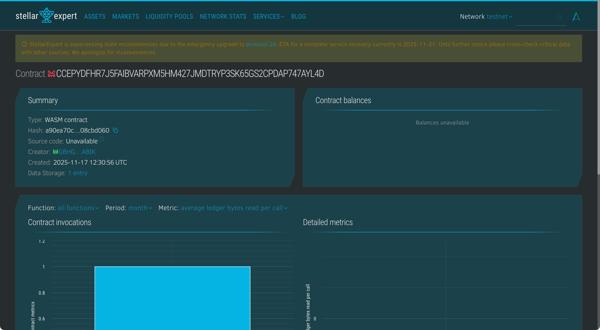

# ScholarshipChain Hub

## Project Description

ScholarshipChain Hub is a decentralized scholarship distribution system built on Stellar's Soroban platform that automates scholarship awards based on verifiable academic performance proofs. This blockchain-based solution eliminates intermediaries, reduces administrative overhead, and ensures transparent, fair, and automated distribution of educational funding.

Students can submit scholarship applications with their GPA scores stored immutably on-chain. The smart contract automatically calculates and approves scholarship amounts based on predefined academic performance tiers, ensuring merit-based distribution without human bias. All transactions are transparent, auditable, and permanently recorded on the blockchain.

## Project Vision

Our vision is to democratize access to educational funding by creating a transparent, automated, and globally accessible scholarship distribution system. We aim to:

- **Eliminate Administrative Barriers**: Remove bureaucratic delays and reduce processing time for scholarship applications
- **Ensure Merit-Based Distribution**: Automate awards based purely on academic performance without bias or favoritism
- **Increase Transparency**: Make all scholarship decisions auditable and verifiable by students and donors
- **Expand Access**: Enable students worldwide to access funding regardless of geographic or institutional barriers
- **Build Trust**: Create an immutable record of academic achievements and scholarship awards
- **Empower Students**: Provide direct access to funding without complex application processes
- **Support Donors**: Give scholarship providers confidence that funds are distributed fairly and efficiently

## Key Features

### 1. Scholarship Application Submission

- Students can apply for scholarships by submitting their GPA scores on-chain
- Each application receives a unique scholar ID for tracking
- Academic performance is recorded with timestamps for verification
- Address-based authentication ensures only legitimate students can apply
- GPA validation ensures data integrity (0.0-4.0 scale, stored as 0-400)
- Automatic status tracking (pending/approved)

### 2. Automated Approval & Disbursement

- Smart contract automatically evaluates applications based on GPA requirements
- Minimum GPA threshold of 3.0 for eligibility
- Tiered scholarship amounts based on academic excellence:
  - **GPA 3.8-4.0**: 2000 XLM scholarship
  - **GPA 3.5-3.79**: 1500 XLM scholarship
  - **GPA 3.0-3.49**: 1000 XLM scholarship
- Instant approval once criteria are met
- Transparent calculation formula visible to all participants
- Prevention of duplicate approvals

### 3. Application Details Retrieval

- Comprehensive scholarship information access:
  - Unique scholar identifier
  - Student's blockchain address
  - Verified GPA score
  - Application submission timestamp
  - Approval status
  - Amount awarded
- Query-friendly interface for building frontend applications
- Graceful error handling for non-existent applications

### 4. Statistical Tracking

- Real-time platform metrics:
  - Total scholarship applications received
  - Number of approved scholarships
  - Pending applications count
  - Total funds disbursed across all scholarships
- Transparency for donors and stakeholders
- Data-driven insights for program improvement

### 5. Security & Transparency

- Address-based authentication preventing fraudulent applications
- Immutable academic records that cannot be tampered with
- Public verifiability of all scholarship decisions
- Storage TTL management for long-term data persistence
- Decentralized architecture eliminating single points of control
- Audit trail for compliance and accountability

## Contract Details
- Contract Address: CCEPYDFHR7J5FAIBVARPXM5HM427JMDTRYP3SK65GS2CPDAP747AYL4D

## Future Scope

### Phase 1: Enhanced Verification

- **Academic Institution Integration**: Direct verification of GPA from university registrars
- **Multi-Criteria Evaluation**: Include extracurricular activities, community service, and leadership
- **Document Upload**: Support for transcripts, recommendation letters, and essays
- **Identity Verification**: KYC integration to prevent duplicate applications
- **Standardized Testing**: Include SAT, ACT, GRE scores in evaluation criteria

### Phase 2: Advanced Scholarship Types

- **Need-Based Scholarships**: Incorporate financial need assessments
- **Subject-Specific Funding**: Scholarships for STEM, arts, humanities, etc.
- **Research Grants**: Funding for specific research projects or publications
- **International Students**: Support for cross-border educational opportunities
- **Recurring Scholarships**: Multi-year funding based on continued performance
- **Emergency Grants**: Quick-disbursement funds for students facing hardship

### Phase 3: Donor & Fundraising Features

- **Donor Dashboard**: Interface for individuals and organizations to create scholarship funds
- **Custom Criteria**: Allow donors to set specific eligibility requirements
- **Matching Programs**: Employer or institutional matching of scholarship contributions
- **Endowment Management**: Long-term fund management with automated disbursement
- **Tax Receipts**: Automated generation of donation receipts for tax purposes
- **Impact Reports**: Show donors how their contributions are being used

### Phase 4: Student Support Ecosystem

- **Mentorship Matching**: Connect scholarship recipients with professional mentors
- **Career Services**: Job placement and internship opportunities for scholars
- **Alumni Network**: Build community among scholarship recipients
- **Skill Development**: Access to courses and certifications funded by scholarships
- **Progress Tracking**: Monitor academic progress and continued eligibility
- **Student Loans**: Integration with decentralized lending for additional financial support

### Phase 5: Smart Contract Enhancements

- **Milestone-Based Disbursement**: Release funds based on semester completion
- **Multi-Token Support**: Accept scholarships in various cryptocurrencies and stablecoins
- **DeFi Integration**: Stake scholarship funds to generate additional funding
- **Governance Token**: Allow stakeholders to vote on policy changes
- **Penalty Mechanisms**: Handle academic misconduct or eligibility violations
- **Refund Protocols**: Return unused funds to donor pools

### Phase 6: Global Expansion

- **Multi-Language Support**: Interface and documentation in multiple languages
- **Regional Adaptations**: Support different grading systems (GPA, percentage, etc.)
- **Partnership Network**: Collaborate with universities, NGOs, and governments
- **Mobile Applications**: Native apps for easy access in developing regions
- **Offline Verification**: Systems for areas with limited internet connectivity
- **Cross-Chain Bridges**: Expand to Ethereum, Polygon, and other blockchains

### Phase 7: AI & Analytics

- **Predictive Analytics**: Identify students at risk of losing eligibility
- **Fraud Detection**: AI algorithms to detect suspicious application patterns
- **Success Metrics**: Track long-term outcomes of scholarship recipients
- **Recommendation Engine**: Suggest scholarships based on student profiles
- **Automated Counseling**: AI-powered guidance for application optimization
- **Market Analysis**: Identify underserved student populations and funding gaps

### Phase 8: Compliance & Accreditation

- **Regulatory Compliance**: Meet international education funding standards
- **Accreditation Integration**: Verify institution legitimacy
- **Data Privacy**: GDPR, FERPA compliance for student information
- **Financial Audits**: Automated compliance reporting for regulators
- **Anti-Money Laundering**: KYC/AML protocols for large transactions

---

## Technical Specifications

**Blockchain**: Stellar (Soroban)  
**Language**: Rust  
**SDK**: soroban-sdk  
**Storage**: Instance storage with 5000 ledger TTL  
**Authentication**: Address-based with require_auth()  
**Token**: XLM (Stellar Lumens) for scholarship disbursement  
**GPA Scale**: 0-400 (representing 0.0-4.0)  
**Minimum Eligibility**: GPA 3.0 (300)

## Smart Contract Functions

1. **apply_scholarship(env, student, gpa_score)** → Returns scholar_id
2. **approve_scholarship(env, scholar_id)** → Approves and calculates award amount
3. **get_scholarship_details(env, scholar_id)** → Returns Scholarship struct
4. **get_scholarship_stats(env)** → Returns ScholarshipStats struct

## Scholarship Tiers

| GPA Range  | Amount (XLM) | Amount (Stroops) |
| ---------- | ------------ | ---------------- |
| 3.8 - 4.0  | 2,000 XLM    | 2,000,000,000    |
| 3.5 - 3.79 | 1,500 XLM    | 1,500,000,000    |
| 3.0 - 3.49 | 1,000 XLM    | 1,000,000,000    |
| < 3.0      | Not Eligible | 0                |

## Getting Started

### Prerequisites

- Rust toolchain (latest stable)
- Soroban CLI tools
- Stellar account with testnet/mainnet XLM
- Basic understanding of Stellar and smart contracts

### Building the Contract

```bash
cargo build --target wasm32-unknown-unknown --release
```

### Running Tests

```bash
cargo test
```

### Deploying to Testnet

```bash
soroban contract deploy \
  --wasm target/wasm32-unknown-unknown/release/scholarship_chain.wasm \
  --source <ADMIN_SECRET_KEY> \
  --rpc-url https://soroban-testnet.stellar.org \
  --network-passphrase "Test SDF Network ; September 2015"
```

### Example Usage

#### Apply for Scholarship

```bash
# GPA 3.85 = 385
soroban contract invoke \
  --id <CONTRACT_ID> \
  --source <STUDENT_SECRET> \
  --fn apply_scholarship \
  --arg <STUDENT_ADDRESS> \
  --arg 385
```

#### Approve Scholarship (Admin)

```bash
soroban contract invoke \
  --id <CONTRACT_ID> \
  --source <ADMIN_SECRET> \
  --fn approve_scholarship \
  --arg 1
```

#### Check Application Status

```bash
soroban contract invoke \
  --id <CONTRACT_ID> \
  --fn get_scholarship_details \
  --arg 1
```

---

## Use Cases

- **University Scholarship Programs**: Automate merit-based institutional funding
- **Corporate CSR Initiatives**: Transparent employee and community scholarship programs
- **Non-Profit Organizations**: Efficient distribution of educational grants
- **Government Programs**: National scholarship schemes with reduced bureaucracy
- **Alumni Associations**: Give-back programs for alma mater students
- **International Aid**: Cross-border educational support for developing nations
- **Bootcamp Funding**: Income share agreements and upfront funding for coding bootcamps

---

## Benefits

### For Students

- Fast, transparent application process
- Immediate notification of award amounts
- No complex paperwork or interviews
- Merit-based evaluation without bias
- Permanent record of academic achievement

### For Donors

- Complete transparency on fund usage
- Automated distribution reduces overhead
- Verifiable impact of contributions
- Tax-efficient charitable giving
- Direct connection to scholarship recipients

### For Institutions

- Reduced administrative burden
- Attract high-performing students
- Enhanced reputation through transparency
- Data-driven program improvements
- Lower operational costs

---

## Contributing

We welcome contributions! Areas where you can help:

- Smart contract enhancements
- Frontend development
- Documentation improvements
- Testing and security audits
- Integration with educational platforms

---

## Security Considerations

- All GPA scores are verified and immutable once submitted
- Address authentication prevents unauthorized approvals
- Scholarship amounts are calculated deterministically
- No funds are held in the contract (integration with payment systems required)
- Regular security audits recommended before mainnet deployment

---

**License**: MIT  
**Maintainers**: ScholarshipChain Hub Team  
**Documentation**: [Full Documentation](#)  
**Support**: [support@scholarshipchain.org](mailto:support@scholarshipchain.org)  
**Community**: [Join our Discord](#) | [Follow on Twitter](#)

---

_Empowering education through blockchain technology_ 🎓✨
